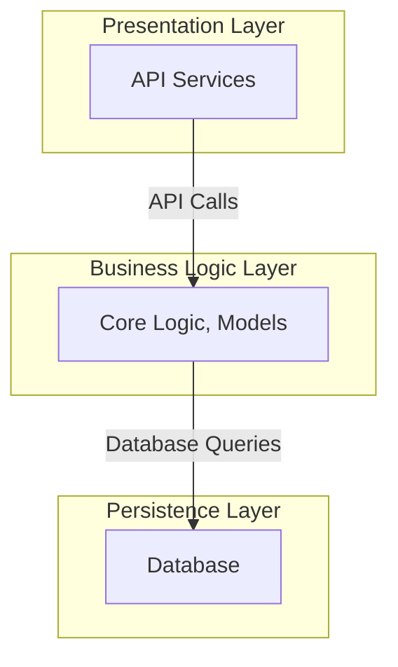
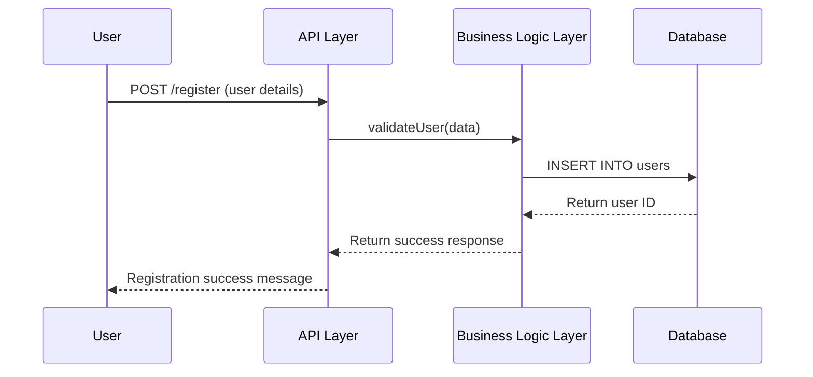
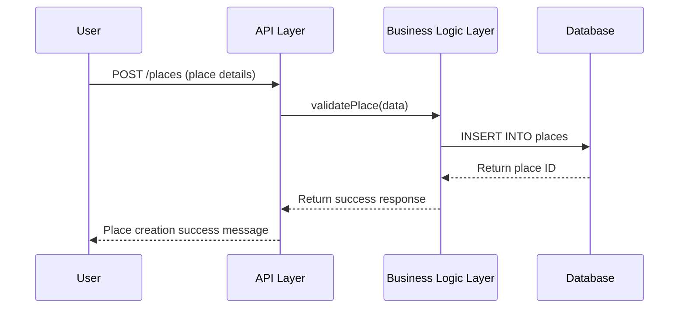
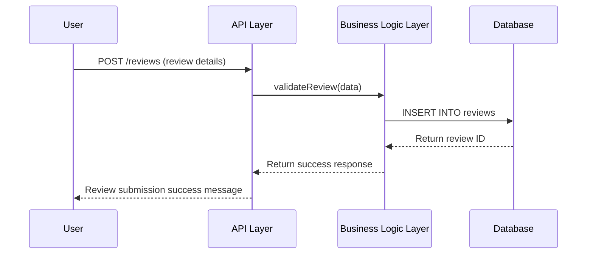

# **HBnB Evolution - Technical Documentation**

## **1. Introduction**
This document serves as a **comprehensive technical blueprint** for the development of the **HBnB Evolution** application, a simplified Airbnb-like system. It outlines the **architecture, business logic, API interactions, and data flows** to provide a structured approach to implementation.

### **1.1 Scope of the Document**
This document contains:
- **High-Level Package Diagram** (System Architecture)
- **Business Logic Layer** (Class Diagram)
- **API Interaction Flow** (Sequence Diagrams for API Calls)
- **Explanatory Notes and Design Decisions**

---

## **2. High-Level Architecture**

### **2.1. High-Level Package Diagram**
The HBnB Evolution application follows a **three-layered architecture** with the **Facade Pattern** to facilitate communication between layers.



### **2.2. Explanation of the Architecture**
- **Presentation Layer**: Handles the interaction between the user and the system (via API calls).
- **Business Logic Layer**: Contains models (`User`, `Place`, `Review`, `Amenity`) and implements core logic.
- **Persistence Layer**: Manages data storage and retrieval through the database.
- **Facade Pattern**: The API only communicates with the **Business Logic Layer**, ensuring modularity and maintainability.

---

## **3. Business Logic Layer**

### **3.1. Class Diagram**
This section presents the **detailed class diagram** covering the core entities: **User, Place, Review, and Amenity**.

```mermaid
classDiagram
  class User {
    +UUID id {unique}
    +String username {unique}
    +String first_name
    +String last_name
    #String email {unique}
    -String password
    #Boolean is_admin
    +DateTime created_at
    +DateTime updated_at
    +register()
    +update_profile()
    +delete_account()
    -encrypt_password()
  }

  class Place {
    +UUID id {unique}
    +String title
    +String description
    +Float price
    +Float latitude
    +Float longitude
    +User owner
    +Boolean is_active
    +List~Amenity~ amenities
    +DateTime created_at
    +DateTime updated_at
    +create_place()
    +update_place()
    +delete_place()
    +list_places()
  }

  class Review {
    +UUID id {unique}
    +Place place
    o-- User : written by
    +Integer rating
    +String comment
    +DateTime created_at
    +DateTime updated_at
    +create_review()
    +update_review()
    +delete_review()
    +list_reviews()
  }

  class Amenity {
    +UUID id {unique}
    +String name {unique}
    +String description
    +DateTime created_at
    +DateTime updated_at
    +create_amenity()
    +update_amenity()
    +delete_amenity()
    +list_amenities()
  }

  User "1" o-- "many" Place : owns
  Place *-- "many" Review : has reviews
  Place "many" o-- "many" Amenity : has amenities
```

### **3.2. Explanation of the Class Diagram**
- **User**: Represents a system user who can own places and write reviews.
- **Place**: Represents a property listed by a `User`. A place can have multiple amenities and reviews.
- **Review**: A rating and comment left by a user for a `Place`.
- **Amenity**: Represents extra features (e.g., WiFi, parking) that can be associated with places.
- **Relationships**:
  - `User o-- Place` → A user owns many places, but places remain if the user is deleted.
  - `User o-- Review` → A user writes reviews, but reviews remain if the user is deleted.
  - `Place *-- Review` → A place has reviews, and if the place is deleted, its reviews are too.
  - `Place o-- Amenity` → Places have multiple amenities, but amenities can exist independently.

---

## **4. API Interaction Flow**

### **4.1. Sequence Diagrams for API Calls**

#### **4.1.1. User Registration**


#### **4.1.2. Place Creation**


#### **4.1.3. Review Submission**


---

## **5. Conclusion**
This document provides a structured foundation for implementing HBnB Evolution. The **architecture, business logic, and data interactions** are well-defined to guide the development process in future phases. The use of **layered architecture, the Facade Pattern, and structured API interactions** ensures that the application is scalable and maintainable.


